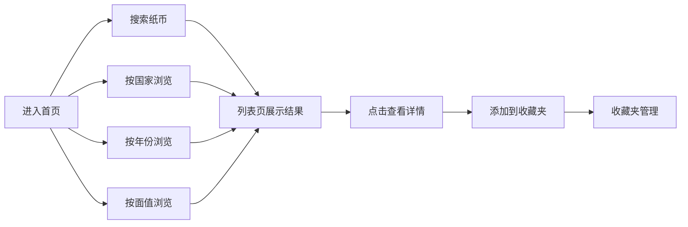

## 1. 产品概述

世界纸币收藏馆是一个收录全球各国各年份、各面值纸币的在线展示平台，为纸币收藏爱好者和历史研究者提供专业、美观、便捷的纸币浏览和检索服务。

- 核心价值：打造全球最丰富的纸币数字博物馆，让用户足不出户就能欣赏到世界各国的纸币文化和历史
- 目标用户：纸币收藏爱好者、历史研究者、文化爱好者、学生群体

## 2. 核心功能

### 2.1 用户角色

| 角色 | 注册方式 | 核心权限 |
|------|---------|---------|
| 访客用户 | 无需注册 | 浏览纸币、搜索筛选、查看详情 |
| 注册用户 | 本地存储模拟 | 收藏纸币、管理收藏夹 |

### 2.2 功能模块

1. **首页**：精选纸币展示、搜索栏、分类导航、热门国家/年份/面值快捷入口
2. **纸币列表页**：多条件筛选（国家、年份、面值、材质）、排序、卡片展示
3. **纸币详情页**：高清图片展示、详细信息参数、历史背景介绍、相关纸币推荐
4. **分类浏览页**：按国家/年份/面值三种维度浏览纸币
5. **收藏夹页**：用户收藏的纸币列表、管理收藏

### 2.3 页面详情

| 页面名称 | 模块名称 | 功能描述 |
|---------|---------|---------|
| 首页 | Hero 区域 | 大幅背景展示纸币美学，搜索框、分类快捷入口 |
| 首页 | 精选展示 | 轮播展示精美纸币，悬停放大效果 |
| 首页 | 分类导航 | 国家、年份、面值三个维度的快捷入口 |
| 首页 | 热门纸币 | 展示收藏量最高的纸币卡片 |
| 纸币列表页 | 筛选栏 | 国家下拉、年份范围、面值范围、材质选择、排序 |
| 纸币列表页 | 卡片网格 | 响应式卡片网格，展示纸币缩略图和关键信息 |
| 纸币详情页 | 图片画廊 | 主图展示、正反两面切换、放大功能 |
| 纸币详情页 | 信息面板 | 国家、年份、面值、尺寸、材质、防伪技术等参数 |
| 纸币详情页 | 历史介绍 | 纸币发行背景、历史意义、文化故事 |
| 纸币详情页 | 相关推荐 | 同国家/同年份的其他纸币 |
| 分类浏览页 | 维度切换 | 国家/年份/面值三个标签切换 |
| 分类浏览页 | 字母索引 | 按字母快速定位国家 |
| 收藏夹页 | 收藏列表 | 已收藏纸币的网格展示 |
| 收藏夹页 | 管理功能 | 移除收藏、批量操作 |

## 3. 核心流程

用户进入首页，通过搜索或分类导航找到感兴趣的纸币，查看详情后可添加到收藏夹。

## 4. 用户界面设计

### 4.1 设计风格

- **主色调**：深金色 #B8860B 与深墨绿 #1A3A3A，营造博物馆般的尊贵感和历史厚重感
- **辅助色**：米色 #F5F5DC 作为背景，点缀红铜色 #CD7F32
- **按钮风格**：圆角 8px，轻微悬浮效果，金色边框装饰
- **字体**：标题使用 Cinzel（衬线字体，古典优雅），正文使用 Noto Serif SC（优雅易读）
- **布局风格**：卡片式布局，金边装饰，米色纹理背景，营造古籍博物馆氛围
- **图标风格**：线性图标，金色描边，配合主题色调

### 4.2 页面设计概述

| 页面名称 | 模块名称 | UI 元素 |
|---------|---------|---------|
| 首页 | Hero 区域 | 渐变深色背景、大型搜索框带金色光晕、装饰性纸币图案、渐入动画 |
| 首页 | 分类导航 | 三个金色图标按钮、悬停上浮效果、交错出现动画 |
| 首页 | 热门纸币 | 卡片带金边、悬停放大、阴影加深、图片缓慢缩放 |
| 列表页 | 筛选栏 | 玻璃拟态效果、圆角下拉框、金色边框聚焦状态 |
| 列表页 | 卡片网格 | 响应式 2-4 列、卡片金边装饰、悬停微动画 |
| 详情页 | 图片画廊 | 大尺寸展示、正反切换标签、放大镜效果 |
| 详情页 | 信息面板 | 两栏布局、金色分割线、图标+文字参数展示 |
| 详情页 | 历史介绍 | 书卷风格背景、首字下沉、优雅排版 |
| 分类页 | 字母索引 | 横向字母导航、激活状态金色高亮 |
| 收藏页 | 空状态 | 优雅插画提示、引导浏览按钮 |

### 4.3 响应式

- 桌面优先设计，断点 1280px / 1024px / 768px / 480px
- 移动端：单列布局、底部导航栏、全屏筛选弹窗
- 平板：两到三列布局、侧边筛选栏可折叠
- 触摸优化：增大点击区域（最小 44x44px）、添加触觉反馈动画

### 4.4 动效设计

- 页面加载：元素交错淡入（staggered fade-in）
- 卡片悬停：上浮 4px + 金色光晕 + 图片 1.03 倍缩放
- 筛选切换：内容区淡入淡出过渡
- 收藏按钮：心形图标填充动画 + 轻微弹跳
- 图片加载：模糊占位符到清晰的渐变过渡
- 滚动：导航栏背景从透明到半透明渐变
