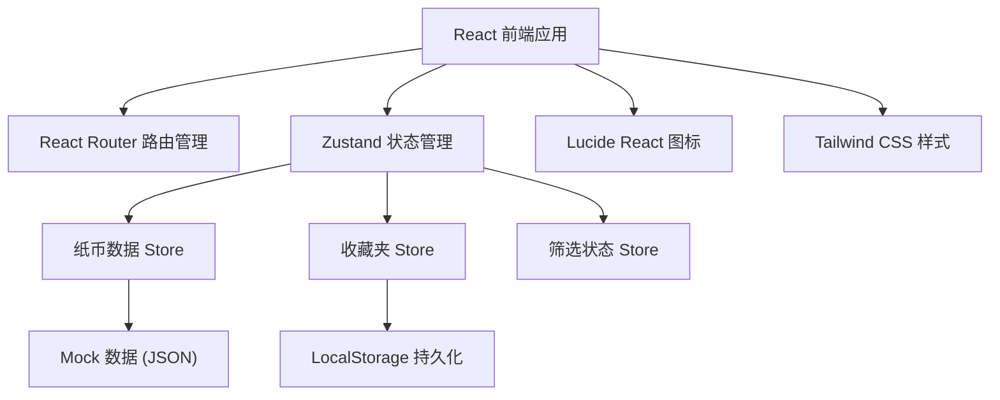
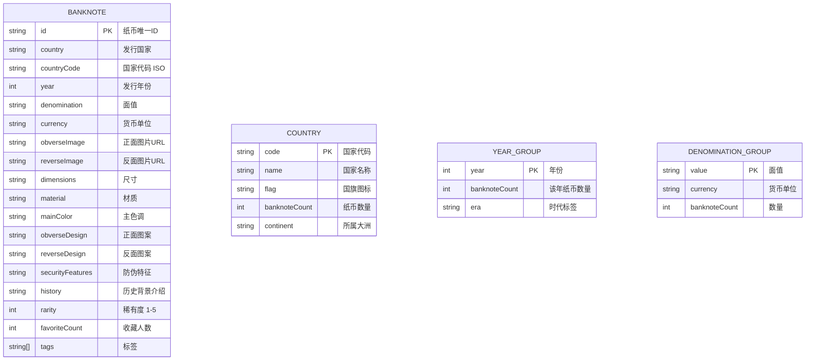

## 1. 架构设计



## 2. 技术描述

- 前端：React@18 + TypeScript + Vite@6
- 样式：TailwindCSS@3 + CSS 变量
- 路由：React Router DOM@7
- 状态管理：Zustand@5
- 图标：Lucide React
- 数据：Mock JSON 数据 + LocalStorage 持久化
- 构建工具：Vite@6
- 无后端，纯前端实现

## 3. 路由定义

| 路由 | 页面 | 用途 |
|-----|------|------|
| `/` | Home | 首页，精选展示和搜索入口 |
| `/banknotes` | BanknoteList | 纸币列表页，支持多条件筛选 |
| `/banknote/:id` | BanknoteDetail | 纸币详情页，展示完整信息 |
| `/countries` | CountryBrowse | 按国家分类浏览 |
| `/years` | YearBrowse | 按年份分类浏览 |
| `/denominations` | DenominationBrowse | 按面值分类浏览 |
| `/favorites` | Favorites | 收藏夹页面 |

## 4. 数据模型

### 4.1 数据模型定义



### 4.2 TypeScript 类型定义

```typescript
interface Banknote {
  id: string;
  country: string;
  countryCode: string;
  year: number;
  denomination: string;
  currency: string;
  obverseImage: string;
  reverseImage: string;
  dimensions: string;
  material: string;
  mainColor: string;
  obverseDesign: string;
  reverseDesign: string;
  securityFeatures: string[];
  history: string;
  rarity: 1 | 2 | 3 | 4 | 5;
  favoriteCount: number;
  tags: string[];
  createdAt: string;
}

interface Country {
  code: string;
  name: string;
  flag: string;
  continent: string;
  banknoteCount: number;
}

interface FilterState {
  search: string;
  country: string;
  yearFrom: number | null;
  yearTo: number | null;
  denomination: string;
  material: string;
  sortBy: 'year' | 'country' | 'favorite';
  sortOrder: 'asc' | 'desc';
}

interface FavoriteState {
  ids: string[];
  addFavorite: (id: string) => void;
  removeFavorite: (id: string) => void;
  isFavorite: (id: string) => boolean;
}
```

## 5. 项目结构

```
src/
├── components/
│   ├── layout/
│   │   ├── Header.tsx        # 顶部导航栏
│   │   ├── Footer.tsx        # 页脚
│   │   └── Layout.tsx        # 布局容器
│   ├── banknote/
│   │   ├── BanknoteCard.tsx  # 纸币卡片组件
│   │   ├── BanknoteGrid.tsx  # 卡片网格
│   │   ├── FilterBar.tsx     # 筛选栏
│   │   └── ImageGallery.tsx  # 图片画廊
│   └── common/
│       ├── SearchBar.tsx     # 搜索框
│       ├── StarRating.tsx    # 稀有度星级
│       └── EmptyState.tsx    # 空状态
├── pages/
│   ├── Home.tsx              # 首页
│   ├── BanknoteList.tsx      # 列表页
│   ├── BanknoteDetail.tsx    # 详情页
│   ├── CountryBrowse.tsx     # 国家浏览
│   ├── YearBrowse.tsx        # 年份浏览
│   ├── DenominationBrowse.tsx # 面值浏览
│   └── Favorites.tsx         # 收藏夹
├── store/
│   ├── useBanknoteStore.ts   # 纸币数据
│   ├── useFilterStore.ts     # 筛选状态
│   └── useFavoriteStore.ts   # 收藏状态
├── data/
│   ├── banknotes.ts          # 模拟纸币数据
│   └── countries.ts          # 国家数据
├── types/
│   └── index.ts              # 类型定义
├── utils/
│   └── cn.ts                 # classNames 工具
├── App.tsx
├── main.tsx
└── index.css
```

## 6. 性能优化

- 图片懒加载：使用 `loading="lazy"` 实现
- 虚拟滚动：列表页使用 Intersection Observer 实现无限滚动
- 记忆化：使用 `useMemo`、`useCallback` 优化重渲染
- 代码分割：按路由级别进行代码分割
- 字体优化：使用 `font-display: swap` 避免 FOIT
- LocalStorage 缓存：收藏数据本地持久化
